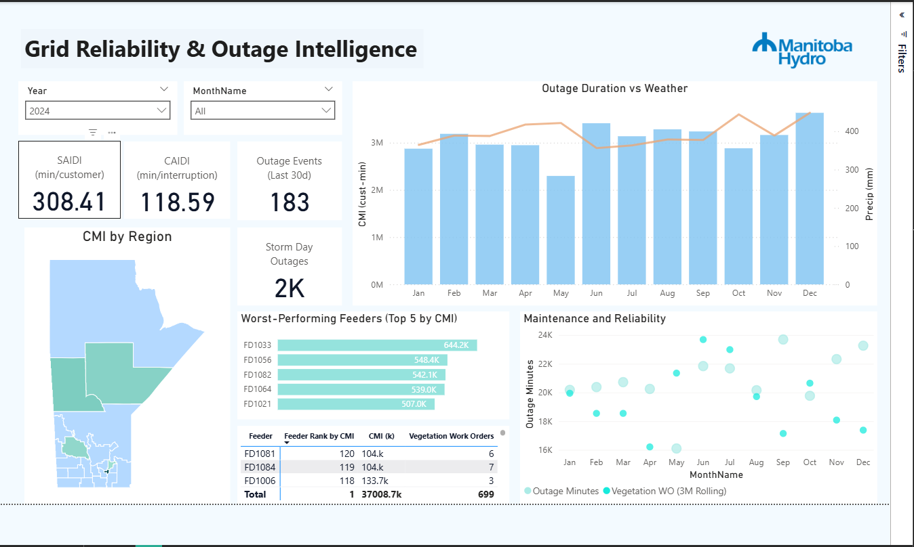

# Manitoba Hydro — Reliability Dashboard (Power BI)

A clean, parameter-driven Power BI report for electric reliability KPIs: **SAIDI**, **CAIDI**, Outage Events, and Customers Affected. Includes interactive map filtering, a feeder drillthrough page, and template-friendly setup (no secrets committed).



---

## ✨ Features
- **KPIs:** SAIDI, CAIDI, Outage Events, Customers Affected  
- **Filters:** Date, Division/Region, Feeder, Cause, Storm Day  
- **Interactions:** Map selection filters trend + top feeders (KPI tiles left unfiltered)  
- **Drillthrough:** Right-click feeder → *Feeder Details* (trend, outage table, causes)  
- **Template-first:** `.pbit` + optional sample `data/` for safe sharing

---

## 📦 Repository Structure
.
├─ reports/
│ ├─ ManitobaHydro.pbix # full report (optional)
│ └─ ManitobaHydro.pbit # template (recommended)
├─ data/ # optional sample CSVs/Excel
├─ assets/
│ └─ overview.png # README screenshot
└─ README.md

yaml
Copy code

---

## 📐 Measures (DAX examples)
> Adjust names to match your model.

```DAX
Total Customer Minutes Interrupted = SUM( Outages[CustomerMinutes] )
Total Customers Served              = SUM( Customers[CustomersServed] )
Total Interruptions                 = COUNTROWS( Outages )

SAIDI = DIVIDE( [Total Customer Minutes Interrupted], [Total Customers Served] )
CAIDI = DIVIDE( [Total Customer Minutes Interrupted], [Total Interruptions] )
Outage Events = COUNTROWS( Outages )
Customers Affected = SUM( Outages[CustomersAffected] )
🗺️ Pages
Overview — KPI tiles, Region/Division map, trend chart (e.g., last 30/90 days), Top Feeders

Feeder Details (Drillthrough) — Monthly trend, outages table, causes (stacked bar), feeder meta

🔧 Parameters (for .pbit)
Typical Power Query parameters:

DataFolderPath (path to sample CSVs/Excel)

DateRangeStart, DateRangeEnd

StormDayOnly (true/false)

Users supply these when opening the template.

🧱 Data Model (example)
Tables

Outages (Date, Feeder, Region/Division, Cause, CustomersAffected, CustomerMinutes, IsStormDay)

Customers (Region/Division, CustomersServed, AsOfDate)

Calendar (Date, Year, Month, MonthName, etc.)

Relationships

Outages[Date] → Calendar[Date]

Outages[Region/Division] → Customers[Region/Division]

Mark Calendar as Date table.

▶️ How to Open
Download reports/ManitobaHydro.pbit (recommended) or reports/ManitobaHydro.pbix

Open in Power BI Desktop (Version 2.x or newer)

If using .pbit, set parameters (e.g., DataFolderPath → data/), then load

🔄 Refresh & Privacy
Repo contains sample/mock data only

Reconnect to real sources locally as needed

Do not commit credentials or sensitive data